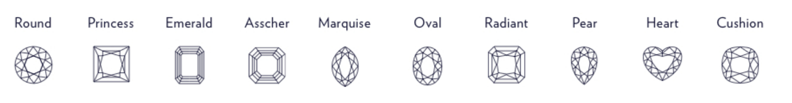

```{r setup, include=FALSE}
knitr::opts_chunk$set(echo = FALSE,warning = FALSE, message = FALSE,fig.height=4, fig.width=10,fig.align = 'center') # out.width="0.9\\linewidth",dev="png",
pacman::p_load(ggplot2, knitr, arm, data.table, foreign, gridExtra, car, stringr, rstan, rstanarm, zoo, dplyr, magrittr)
Sys.setenv(LANGUAGE = "en")

dt0 <- read.csv("diamonds_dataset.csv",header=T,sep=",")
dt0 <- dt0[, c("shape","price","carat","cut","color","clarity","report","type")]
dt0 <- as.data.frame(dt0)
dt0$shape <- as.factor(dt0$shape)
dt0$price <- as.numeric(dt0$price)
dt0$carat <- as.numeric(dt0$carat)
dt0$cut <- factor(dt0$cut, levels =c("Fair","Good","Very Good","Ideal","Super Ideal") )
dt0$color <- factor(dt0$color, levels = c("J","I","H","G","F","E","D"))
dt0$clarity <- factor(dt0$clarity, levels = c("SI2","SI1","VS2","VS1","VVS2","VVS1","IF","FL"))
dt0$report <- as.factor(dt0$report)
dt0$type <- as.factor(dt0$type)


# dt0 <- within(dt0, clarity <- relevel(clarity, ref = 'SI2')) ## SI2 is the lowest clarity
# dt0 <- within(dt0, color <- relevel(color, ref = 'J')) ## J is the lowest color grade
# dt0 <- within(dt0, cut <- relevel(cut, ref = 'Good')) ## Good is the lowest quality cut

# dt <- subset(dt0,carat <= 1.5 & price <= 22026)
dt1 <- dt0 %>%
  filter(carat <= 1.5) %>%
  filter(price <= 22026)  %>%
  mutate(log_price = log(price), log_carat = log(carat))

smp_size <- floor(0.1 * nrow(dt1))
sam_ind <- sample(seq_len(nrow(dt1)), size = smp_size)
# creating test and training sets that contain all of the predictors
dt <- dt1[sam_ind, ]
```

# Abstract

This report is exploring the impact of different properties of diamonds on prices and tries to reduce the impact of the fact that higher-quality diamonds have lower weight in the analysis when doing the model regression. Overall, I found that weight is still the most important factor determining the price of diamonds. The price of natural diamonds is many times different from that produced in the laboratory. The pricing rules of diamonds of different shapes are roughly the same. The most popular round shape is somewhat above average. These conclusions may help consumers buy diamonds more rationally and avoid consumption traps.

# Introduction

Buying diamonds represents a huge expenditure of money, the process is very time-consuming and can be frustrating, since there are so many aspects to consider. In this report, I will focus on how diamond level (clarity, color, cut), diamond-type (nature or lab), and diamond weight (carat) affect the prices. 

First, I will use EDA to explore the relationship between predictors and outcomes, as well as the relationship between each predictor. And then, since the diamonds are divided into different shapes, I will build a multilevel model, and base on the findings from the EDA process, select the most suitable model for specific analysis and model evaluation and prediction. Finally, I will give some conclusions about diamond pricing.

This report may not only help you avoid consumption traps, make consumption decisions with a theoretical basis, and even provide ideas for understanding the complex logic of general product pricing.

# Method

## Data for Modeling

The clean data for regression including 10,062 observations and 10 variables, the specific data processing procedure is provided in the appendix.

Here are necessary explanations of important variables:


| column names   | explanation |
| :--:           | :----- |
| cut            | order of cut: Fair < Good < Very Good < Ideal < Super Ideal |
| clarity        | order of clarity: SI2 < SI1 < VS2 < VS1 < VVS2 < VVS1 < IF < FL |
| color          | order of color: J < I < H < G < F < E < D |
| shape          | different shapes of diamonds|
| log_price      | log(price), log of price in US dollars   |
| log_carat      | log(carat), log of weight of the diamond |


## Exploratory Data Analysis

EDA below helps to see if there is any correlation between some variables and price, which is instructive when I try to make a model regression to solve the problem that how some factors of diamonds affect their price.  

```{r}
ggplot(data = dt)+
  aes(log(carat),log(price))+
  geom_point(aes(color = shape),alpha = 0.1)+
  labs(title="",x="log(carat)",y="log(price)")+
  geom_smooth(aes(color = shape),method = "lm",se=F,size=2)+
  # facet_grid(~ type)+
  theme(panel.grid.major = element_blank(), panel.grid.minor = element_blank(),panel.background = element_blank(), axis.line = element_line(colour = "black")) 
```

The figure above shows the relationship between carat and price among different shapes. Different colors represent different shapes. It is obvious that with different shapes the slope and intercept are slightly different, which indicates the effect of shape is random. So, it's maybe appropriate to use a random effect for the model.

```{r,fig.height=6, fig.width=10,}
par(mfrow = c(2, 2))
boxplot(data=dt, carat ~ cut, col = "paleturquoise")
boxplot(data=dt, carat ~ clarity, col = "paleturquoise")
boxplot(data=dt, carat ~ color, col = "paleturquoise")
boxplot(data=dt, carat ~ type, col = "paleturquoise")
```

The figure above shows the relationship between carat and other variables. The obvious difference in the distribution of carat among different levels of `color`, `type`, and `clarity` indicates that it's necessary to add interaction terms in the model. For a more detailed density distribution plots, please refer to the violin diagram in appendix.


```{r,fig.cap=" Detecting Correlation"}
dt_cor <- dt[, c('log_carat','shape','cut','clarity','color','type')]
dt_cor$shape <- as.numeric(dt_cor$shape)
dt_cor$log_carat <- as.numeric(dt_cor$log_carat)
dt_cor$cut <- as.numeric(dt_cor$cut)
dt_cor$color <- as.numeric(dt_cor$color)
dt_cor$clarity <- as.numeric(dt_cor$clarity)
dt_cor$type <- as.numeric(dt_cor$type)
library(ggcorrplot)
ggcorrplot(cor(dt_cor), hc.order = TRUE, type = "lower",
   outline.col = "black",
   # ggtheme = ggplot2::theme_gray,
   colors = c("#6D9EC1", "white", "#E46726"),
   lab = TRUE)
# 
# ggsave("Correlation.png")
```


The figure above is the correlation matrix, which displays the correlation coefficients between continuous variables. After we transfer the category variables to numeric type temporarily, we can see that the variables don't have a strong correlation, which ensures the rationality of our model to some extent.


## Model Fitting

```{r include=FALSE}
library(lmerTest)

dt_num <- dt
dt_num$log_carat <- as.numeric(dt_num$log_carat)
dt_num$cut       <- as.numeric(dt_num$cut)
dt_num$color     <- as.numeric(dt_num$color)
dt_num$clarity   <- as.numeric(dt_num$clarity)

fit <- lmer(log_price ~ log_carat+cut+type+color+clarity+log_carat*clarity+color*log_carat +type*log_carat +(1+log_carat|shape),dt_num) 
summary(fit)
```

```{r}
fit0 <- lmer(log_price ~ log_carat+cut+type+color+clarity+log_carat*clarity+color*log_carat +type*log_carat +(1+log_carat|shape),dt) 
fitlm <- lm(log_price ~ log_carat+cut+type+color+clarity+log_carat*clarity+color*log_carat +type*log_carat,dt_num)
# summary(fit)
# summary(fit0)
# summary(fitlm)
```


As the EDA shows above, considering that diamonds have different shapes, it's necessary to use a multilevel model and take shape as a random effect. This is reasonable, because different shapes of diamond have a different expenditure of time and material due to different polishing process, and the popularity of each shape is different, which ultimately affect the relationship between carat and price. 

The interaction terms are also necessary to be inculed as the EDA shows above. Thinking realistically, a higher level of clarity and color meaning scarcity, and because of the scarcity of natural resources, it's inevitable that diamonds from natural or having a higher level of clarity or color are smaller in mass but more expensive than lab-produced and normal quality ones. I also tried to add the interaction term of `cut` and `carat` into the model, but the effect is not ideal. That's not surprising, as shown in EDA, there are only slight differences of carat among different cuts. Therefore, the interaction of cut and carat is not included in my final model.

Also, to match the evaluation plots to EDA plots, the model keeps using the log of carat as a predictor and the log of price as the outcome.

After comparing the results and validation of different choices of model, I found the model below is the most fitted one to the sample data. A detailed model selection process is displayed in the appendix.

Below is the final formula of the model:   

```{r,echo = TRUE, eval=FALSE}
model <- lmer(log_price ~ log_carat + cut + type + color + clarity 
              + log_carat*clarity + log_carat*color  + log_carat*type
              + (1 + log_carat | shape), dt)
```


# Result

To better interpret the model results, I transformed the category variables `clarity`(8 levels), `color`(7 levels), `cut`(5 levels) from factor type to numerical type. The coefficients don't change significantly after this transformation. The specific coefficient comparison is shown in the appendix.


### Random Effect

|        |Intercept   |log_carat   |
|:---:   |:---:       |:---:       |
|Asscher |-0.042994776|-0.014967941|
|Cushion |-0.060757032|-0.047508258|
|Emerald |-0.067008100| 0.015462114|
|Heart   |-0.053355903|-0.199597490|
|Marquise| 0.014599556| 0.008543657|
|Oval    | 0.066080857| 0.059309911|
|Pear    | 0.003806297|-0.004359567|
|Princess|-0.032015902| 0.090514037|
|Radiant | 0.042811662| 0.169333438|
|Round   | 0.128833342|-0.076729900|


From the result of the random effect, we can see that the influence of different shapes is always not the same. 

For `Round shape`, the intercept is 0.13, which is larger than others. I think it may be because 68% of the diamonds in our data are round shapes, which is reflected in its relatively large random influence on the model.  At the same time, the random effect of round shape log_carat is -0.08, which also make sense, because most high-level `clarity` and `Color` diamonds, as well as those from `nature`, are round, and as I mentioned above, they are relatively small in mass, so the `round shape` has a negative impact on carats. The figure named "Density about shape" in the appendix displays the detail from a numeric aspect.

### Fixed Effect

As the result of fixed effects shows below, all the variables are significant at alpha = 0.05 level.


|                      |Estimate  |Std. Error|df        |t value |Pr(>|t|)    |
|:---:                 |:---:     |:---:     |:---:     |:---:   |:---:       |   
|(Intercept)           |6.632e+00 |2.309e-02 |1.310e+01 |287.161 | < 2e-16 ***|
|log_carat             |1.478e+00 |3.568e-02 |9.632e+00 | 41.439 |3.52e-12 ***|
|cut                   |4.069e-02 |1.808e-03 |1.004e+04 | 22.509 | < 2e-16 ***|
|typenatural           |9.963e-01 |4.377e-03 |1.005e+04 |227.607 | < 2e-16 ***|
|color                 |7.971e-02 |1.156e-03 |1.004e+04 | 68.969 | < 2e-16 ***|
|clarity               |8.365e-02 |1.384e-03 |1.004e+04 | 60.424 | < 2e-16 ***|
|log_carat:clarity     |1.926e-02 |1.852e-03 |1.004e+04 | 10.397 | < 2e-16 ***|
|log_carat:color       |1.575e-02 |1.665e-03 |1.004e+04 |  9.459 | < 2e-16 ***|
|log_carat:typenatural |1.440e-01 |6.826e-03 |1.005e+04 | 21.097 | < 2e-16 ***|


### An Example of Interpretation

For Round shape, we can conclude this formula: 

$$log(price)= 6.75 + 1.40\cdot log(carat) + 0.04\cdot cut + 1.00\cdot typenatural + 0.08\cdot color+0.08  \cdot clarity $$
$$ \\\\\\\\\\\\\\\\\\\\\\\\\\ + 0.02 \cdot log\_carat*clarity + 0.02 \cdot log\_carat*color + 0.14 \cdot log\_carat*typenatural$$


When other predictors are held constant,

every 1% increase in the carat  is associated with $(1.40+ 0.02 \cdot clarity + 0.02 \cdot color + 0.14 \cdot typenatural) \%$ increase in price on average. Since we converted the ordered variable to a numeric type, the lowest level is recorded as 0. Therefore, for each increase in the level, the corresponding numeric type increases by 1;

each grade of cut increases will multiply the price by about $e^{0.04}$; each grade of clarity increases will multiply the price by about $e^{0.08+0.02\cdot ln(carat)}$, which means the change of price will be related to the specific carat; each grade of color increases will multiply the price by about $e^{0.08+0.02\cdot ln(carat)}$, which also means the change will be related to the specific carat;

and, the average price of a natural diamond is $e^{1+0.14\cdot ln(carat)}$ times that of a laboratory diamond.


### Model Validation

I check the model from numeric and graphic aspects, the good results indicate the model above fits well with the sample data. The detailed evaluation is displayed in the appendix.


# Discussion

### Conclusion

According to the random effects table, the shape has a very minimal effect, which makes me speculate that it maybe a consumer trap when a seller claims that a diamond of a particular shape (like clover shape) will cost significantly more than a round or oval diamond because of its craftsmanship.

For the fixed table, although the coefficient of `clarity`, `color`, and `cut` is very small, its influence on the price increases by multiple, so its power should not be underestimated when pricing a diamond.

I think the results above balance the brand effect to some extent and can promote rational consumption of consumers.


### For further improvement

**Deal with confounding variable**: There's always been a common discussion about the pricing of diamonds, which is the weight of the diamond seems to be the only factor that determines the price. But in fact, high-quality natural diamonds are often of low weight. I tried to solve the problem caused by the confounding variable `carat` to some extent by adding interaction, but the regression results did not seem to show the effect of quality on weight, so the suspicion that lower-quality diamonds have higher prices was not solved.

**Attempt more data and models**: Because the data for regression was sifted through the original data set, it would be overgeneralizing to predict a pricing pattern of diamonds with just over 10,000 data. And although my residuals are good, I am somewhat expecting to see some outliers, such as those with large residuals, which means that the price of these diamonds may be too low or too high than expected, which can even provide us with the opportunity to buy the diamonds that have been priced low incorrectly.


# Citations/Sources

+ Data Source
  + https://www.kaggle.com/miguelcorraljr/brilliant-diamonds/


+ Discussion about Diamonds
  + https://www.laurenbjewelry.com/blog/round-diamonds-expensive-shapes/
  + https://www.bluenile.com/education/diamonds/shape


+ Mixed Effect Model Interpretation and Model Checking
  + https://www.ssc.wisc.edu/sscc/pubs/MM/MM_TestEffects.html#testing-mixed-models-parameters
  
  + https://cran.microsoft.com/snapshot/2017-08-01/web/packages/sjPlot/vignettes/sjplmer.html
  
  + https://vitalflux.com/fixed-vs-random-vs-mixed-effects-models-examples/
  


\newpage
# Appendix

<center> 



</center>

### Data Cleaning and Processing

The main data set is published on [Kaggle: Brilliant Diamonds-Ultimate Dataset](https://www.kaggle.com/miguelcorraljr/brilliant-diamonds). 

Below is the summary of raw data

```{r}
summary(dt0)
```


I got 119307 observations from the raw data set. As I see the density and distribution of `price` and `carat`, I find that they have a long tail, which indicates they have a large range. Therefore, I exclude the extreme data that deviates a lot from the median. Because there are only 18669/119307 = 16% diamonds are over 1.5 carat, and only 1338/119307 = 1.12% diamonds are over e^10 = 22026 dollars. So I narrow down the raw data by adding filter carat <= 1.5 & price <= 22026. Besides, I do a log transformation for carat and price variables and mutate them as new columns. 

```{r}
dprice       <- ggplot(data=dt0,aes(x=log(price)      )) +
  geom_histogram(aes(y=..density..),bins=15,fill="#f0a195") +
  geom_density(adjust = 1L,alpha=.4,fill="#f0a195") + # lwd=0.1
  labs(title="log(price)") +
  theme(panel.grid.major = element_blank(), panel.grid.minor = element_blank(),panel.background = element_blank(), axis.line = element_line(colour = "black")) 

clean_dprice <- ggplot(data=dt1,aes(x=log(price))) + 
  geom_histogram(aes(y=..density..),bins=15,fill="#f0a195") + 
  geom_density(adjust = 1L,alpha=.4,fill="#f0a195") +
  labs(title="clean_log(price)") +
  theme(panel.grid.major = element_blank(), panel.grid.minor = element_blank(),panel.background = element_blank(), axis.line = element_line(colour = "black")) 

dcarat       <- ggplot(data=dt0,aes(x=log(carat))) +
  geom_histogram(aes(y=..density..),bins=15,fill="#c6dbef") +
  geom_density(adjust = 1L,alpha=.4,fill="#c6dbef") +
  labs(title="log(carat)") +
  theme(panel.grid.major = element_blank(), panel.grid.minor = element_blank(),panel.background = element_blank(), axis.line = element_line(colour = "black")) 

clean_dcarat <- ggplot(data=dt1,aes(x=log(carat))) +
  geom_histogram(aes(y=..density..),bins=15,fill="#c6dbef") +
  geom_density(adjust = 1L,alpha=.4,fill="#c6dbef") +
  labs(title="clean_log(carat)") +
  theme(panel.grid.major = element_blank(), panel.grid.minor = element_blank(),panel.background = element_blank(), axis.line = element_line(colour = "black")) 

grid.arrange(dprice,clean_dprice,dcarat,clean_dcarat, ncol = 2)
```

According to the figure above, the data after cleaning is more uniform and neat. Some outliers can be ruled out, such as one natural diamond in the dataset which costs $1,348,720, and weighs 11.41 carat with the highest quality in color, cut, and clarity.

### More EDA

To get better figures, I narrow down the size of data for EDA and modeling by selecting randomly. As a result, there are about 10,000 data in the dataset for EDA. 

The following plots indicate the different relationships between carats and prices for different grades of diamonds from `color`, `type`, and `clarity` aspects.

```{r}

p2 <- ggplot(dt1,aes(log(carat),log(price),color=clarity)) +
  geom_point(alpha = 0.03) +
  geom_smooth(formula=y~x,method="lm",aes(group=clarity),se=F) +
  labs(x = NULL, y = NULL)+ theme_bw()


#The effect of location is random (varying slope):
#Depth
p3 <- ggplot(dt1,aes(carat,log(price),color=type)) +
  geom_point(alpha = 0.03) +
  geom_smooth(formula=y~x,method="lm",aes(group=type),se=F) +
  labs(x = NULL, y = NULL)+ theme_bw()

p4 <- ggplot(dt1,aes(carat,log(price),color=color)) +
  geom_point(alpha = 0.03) +
  geom_smooth(formula=y~x,method="lm",aes(group=color),se=F) +
  labs(x = NULL, y = NULL)+ theme_bw()

# ggplot(dt1,aes(carat,log(price),color=cut)) +
#   geom_point(alpha = 0.03) +
#   geom_smooth(formula=y~x,method="lm",aes(group=cut),se=F) +
#   ylab("log(price)")
                                 
#Display
grid.arrange(p2,p3,p4,ncol=3,bottom="log(Carat)", left = "log(price)")

```

The figure above shows the different effects of different levels within a variables indicates it's necessary to add interaction of them to carat.


### Model Selection

```{r}
fit1 <- lmer(log_price ~ log_carat+cut+type+color+clarity+(1|shape),dt)
fit2 <- lmer(log_price ~ log_carat+cut+type+(1+log_carat|color)+(1+log_carat|clarity)+(1|shape),dt)
fit3 <- lmer(log_price ~ log_carat+cut+type+color+clarity+log_carat*clarity+color*log_carat+(1|shape),dt)
fit4 <- lmer(log_price ~ log_carat+cut+type+color+clarity+log_carat*clarity+(1+log_carat|shape),dt)
fit5 <- lmer(log_price ~ log_carat+cut+type+color+clarity+log_carat*clarity+color*log_carat+(1+log_carat|shape),dt)
fit6 <- lmer(log_price ~ log_carat+cut+type+color+clarity+log_carat*clarity+color*log_carat +type*log_carat +(1+log_carat|shape),dt)
anova(fit1,fit2,fit3,fit4,fit5,fit6)
```

The smaller AIC always indicate better model.


### Visualization of random effect

```{r}
library(merTools)
# predictInterval(fit)
randf <- REsim(fit)
# ran_beta0 <- filter(randf, term== c("(Intercept)"))
# ran_beta1 <- filter(randf, term== c("log_carat"))
# par(mfrow = c(1,2))
# ran1 <- plotREsim(ran_beta0 , labs = ran_beta0$groupID)+labs( y = NULL,title = NULL)
# ran2 <- plotREsim(ran_beta1)+labs(x = NULL, y = NULL,title = NULL)
# grid.arrange(ran1,ran2,nrow=1, bottom = "shape")
ggplot(randf) + 
  geom_pointrange(aes(x = groupID, y = mean, ymax = mean+2*sd, ymin = mean-2*sd, group = term, color = term), lwd=1, size=5) +
  facet_wrap(~term, ncol = 3) + ylab("Random Effect") + xlab("Shape") + 
  theme(axis.text.x = element_text(angle = 45, hjust = 1, size = 15)) + theme(legend.position = "none") +theme_bw()
#ggsave("ranplot.png", ranplot)
```


### Eveluation

```{r}
library(lattice)
resid <-  plot(fit, main = "Residual Plot")
qq<- qqmath(fit, main = "Q-Q pot")
lev <- ggplot(data.frame(lev=hatvalues(fit),pearson=residuals(fit,type="pearson")),
      aes(x=lev,y=pearson)) + geom_point() + theme_bw()+  labs(title="Residual vs. Leverage")
grid.arrange(resid, qq,lev, nrow = 1)
```

Graphically, from the *Normal Q-Q Plot*, we can tell that all points roughly fall into a straight line which indicates the assumption of normality is satisfied. From the* Residual plot*, we can tell that the residuals are evenly distributed around the center line and there are no particular patterns or clusters which indicates our model has a good fit. From the *Leverage plot*, we can tell that there is no obvious leverage point. 

```{r}
library(performance)
model_performance(fit)
```

Numerically: The Conditional $R^2$ and Marginal $R^2$ is close to 1, including other nice output of checking above that indicate our model fit well.


### Prediction

To visualize the model by drawing predicted values, I generate an evenly spaced grid of points from the data. 

```{r}
library(modelr)
grid1 <- dt %>%
  data_grid(color, .model = fit0) %>%
  add_predictions(fit0)
gr1 <- ggplot(grid1,aes(color,pred))+geom_point(size=3)+theme(axis.title.x = element_text(size = 14),axis.title.y = element_text(size = 14))+theme_bw()

grid2 <- dt %>%
  data_grid(clarity, .model = fit0) %>%
  add_predictions(fit0)
gr2 <- ggplot(grid2,aes(clarity,pred))+geom_point(size=3)+theme(axis.title.x = element_text(size = 14),axis.title.y = element_text(size = 14))+theme_bw()

grid3 <- dt %>%
  data_grid(cut, .model = fit0) %>%
  add_predictions(fit0)
gr3 <- ggplot(grid3,aes(cut,pred))+geom_point(size=3)+theme(axis.title.x = element_text(size = 14),axis.title.y = element_text(size = 14))+theme_bw()
grid.arrange(gr1,gr2,gr3,ncol=3)
```


### Full Results

Random effects of model
```{r echo=FALSE}
ranef(fit)
```

Fixed effects of model
```{r echo=FALSE}
fixef(fit)
```

Coefficients of model
```{r echo=FALSE}
coef(fit)
```


### Other Plots

```{r}
library(ggridges)
library(ggplot2)
violin <- function(col,name){
#  col <- clarity
 # name <- "clarity"
  title0 <- paste(name)

p <- dt %>%
  ggplot( aes(x=col, y=carat, fill=col, color=col)) +
    geom_violin(width=2.1, size=0.2, show.legend = FALSE) + scale_fill_brewer(palette = "Set3")+ 
    theme_bw() +
    theme(legend.position="none") +
    coord_flip() + #  switch X and Y axis and allows to get the horizontal version
    labs(title = title0, x = NULL, y = NULL)

return(p)
}

v1 <- violin(dt$clarity,"clarity") 
v2 <- violin(dt$color,"color")
v3 <- violin(dt$type,"type")

grid.arrange(v1,v2,v3,ncol=3, bottom="Carat")

```

Violin plot describes the distribution of the data. The plots above indicate that the data is unevenly distributed between different levels of `color`, `clarity`, and `type`.


```{r, "Density about shape"}
# Pie chart:
# par(mfrow = c(1,1))
# dt_pie <- table(dt$shape) # creat dt_pie
# labels <- paste(round(prop.table(dt_pie)*100), "%", sep = " ",names(dt_pie)) # creat labels
# pie(dt_pie,labels = labels,  
#      col = hsv(seq(0,1 - 1/12,length.out = 12), 0.5 , 1), main = "Distribution of diamond shape") # draw the # Density of shape vs. price

d5 <- ggplot(data=dt, aes(x=price, group=shape, fill=shape)) +
    geom_density(adjust=1.5, position="fill", show.legend = FALSE) + scale_fill_brewer(palette = "Set3")+ 
    labs(title = "Price density",y = NULL)+ theme_bw()
d6 <- ggplot(data=dt, aes(x=carat, group=shape, fill=shape)) +
    geom_density(adjust=1.5, position="fill") + scale_fill_brewer(palette = "Set3")+ 
    labs(title = "Carat density",y = NULL)+ theme_bw()
grid.arrange(d5,d6,ncol = 2) 


d3 <- ggplot(data=dt, aes(x=price, group=clarity, fill=clarity)) +
    geom_density(adjust=1.5, position="fill", show.legend = FALSE) + scale_fill_brewer(palette = "Set3")+ 
    labs(title = "Price density",y = NULL)+ theme_bw()
d4 <- ggplot(data=dt, aes(x=carat, group=clarity, fill=clarity)) +
    geom_density(adjust=1.5, position="fill") + scale_fill_brewer(palette = "Set3")+ 
    labs(title = "Carat density",y = NULL)+ theme_bw()
grid.arrange(d3,d4,ncol = 2) 

d1 <- ggplot(data=dt, aes(x=price, group=color, fill=color)) +
    geom_density(adjust=1.5, position="fill", show.legend = FALSE) + scale_fill_brewer(palette = "Set3")+ 
    labs(title = "Price density",y = NULL)+ theme_bw()
d2 <- ggplot(data=dt, aes(x=carat, group=color, fill=color)) +
    geom_density(adjust=1.5, position="fill") + scale_fill_brewer(palette = "Set3")+ 
    labs(title = "Carat density",y = NULL)+ theme_bw()
grid.arrange(d1,d2,ncol = 2) #+bottom = "Top 10 words clustered by sentiment from different lexicon"

```

The figure above shows that the specific distribution of diamonds and the price of different categorical predictors. Uneven distribution tends to bring confounding problems.


# Comparison of the results of model with different attributes predictors.

```{r}
library(texreg)
screenreg(list(fit,fit0),
          custom.model.names = c("numeric(predictor)", "factor(predictor)"))
```

# Citations  
+ EDA
  + https://bootstrappers.umassmed.edu/bootstrappers-courses/pastCourses/rCourse_2016-04/Additional_Resources/Rcolorstyle.html#heat.colors
  
  + https://www.r-graph-gallery.com/135-stacked-density-graph.html (density plot)
  
  + https://www.google.com/search?q=how+to+interpret+ggcorrplot&oq=how+to+interpret+ggcorrplot&aqs=chrome..69i57j0i13.2887j0j9&sourceid=chrome&ie=UTF-8#kpvalbx=_bVKwYYjIArCcptQPxZO30Ak43 (correlation plot)
  
  + https://www.r-graph-gallery.com/
   
   
# Supplement

This part includes all the codes uisng in the main part:

```{r, echo = TRUE, eval = FALSE}
knitr::opts_chunk$set(echo = FALSE,warning = FALSE, message = FALSE,fig.height=4, fig.width=10,fig.align = 'center') # out.width="0.9\\linewidth",dev="png",
pacman::p_load(ggplot2, knitr, arm, data.table, foreign, gridExtra, car, stringr, rstan, rstanarm, zoo, dplyr, magrittr)
Sys.setenv(LANGUAGE = "en")

dt0 <- read.csv("diamonds_dataset.csv",header=T,sep=",")
dt0 <- dt0[, c("shape","price","carat","cut","color","clarity","report","type")]
dt0 <- as.data.frame(dt0)
dt0$shape <- as.factor(dt0$shape)
dt0$price <- as.numeric(dt0$price)
dt0$carat <- as.numeric(dt0$carat)
dt0$cut <- factor(dt0$cut, levels =c("Fair","Good","Very Good","Ideal","Super Ideal") )
dt0$color <- factor(dt0$color, levels = c("J","I","H","G","F","E","D"))
dt0$clarity <- factor(dt0$clarity, levels = c("SI2","SI1","VS2","VS1","VVS2","VVS1","IF","FL"))
dt0$report <- as.factor(dt0$report)
dt0$type <- as.factor(dt0$type)

dt1 <- dt0 %>%
  filter(carat <= 1.5) %>%
  filter(price <= 22026)  %>%
  mutate(log_price = log(price), log_carat = log(carat))

smp_size <- floor(0.1 * nrow(dt1))
sam_ind <- sample(seq_len(nrow(dt1)), size = smp_size)
dt <- dt1[sam_ind, ]

ggplot(data = dt)+
  aes(log(carat),log(price))+
  geom_point(aes(color = shape),alpha = 0.1)+
  labs(title="",x="log(carat)",y="log(price)")+
  geom_smooth(aes(color = shape),method = "lm",se=F,size=2)+
  theme(panel.grid.major = element_blank(), panel.grid.minor = element_blank(),panel.background = element_blank(), axis.line = element_line(colour = "black")) 

par(mfrow = c(2, 2))
boxplot(data=dt, carat ~ cut, col = "paleturquoise")
boxplot(data=dt, carat ~ clarity, col = "paleturquoise")
boxplot(data=dt, carat ~ color, col = "paleturquoise")
boxplot(data=dt, carat ~ type, col = "paleturquoise")

dt_cor <- dt[, c('log_carat','shape','cut','clarity','color','type')]
dt_cor$shape <- as.numeric(dt_cor$shape)
dt_cor$log_carat <- as.numeric(dt_cor$log_carat)
dt_cor$cut <- as.numeric(dt_cor$cut)
dt_cor$color <- as.numeric(dt_cor$color)
dt_cor$clarity <- as.numeric(dt_cor$clarity)
dt_cor$type <- as.numeric(dt_cor$type)
library(ggcorrplot)
ggcorrplot(cor(dt_cor), hc.order = TRUE, type = "lower",
   outline.col = "black",
   # ggtheme = ggplot2::theme_gray,
   colors = c("#6D9EC1", "white", "#E46726"),
   lab = TRUE)

library(lmerTest)
dt_num <- dt
dt_num$log_carat <- as.numeric(dt_num$log_carat)
dt_num$cut       <- as.numeric(dt_num$cut)
dt_num$color     <- as.numeric(dt_num$color)
dt_num$clarity   <- as.numeric(dt_num$clarity)

fit <- lmer(log_price ~ log_carat+cut+type+color+clarity+log_carat*clarity+color*log_carat +type*log_carat +(1+log_carat|shape),dt_num) 
summary(fit)

fit0 <- lmer(log_price ~ log_carat+cut+type+color+clarity+log_carat*clarity+color*log_carat +type*log_carat +(1+log_carat|shape),dt) 
fitlm <- lm(log_price ~ log_carat+cut+type+color+clarity+log_carat*clarity+color*log_carat +type*log_carat,dt_num)
```

